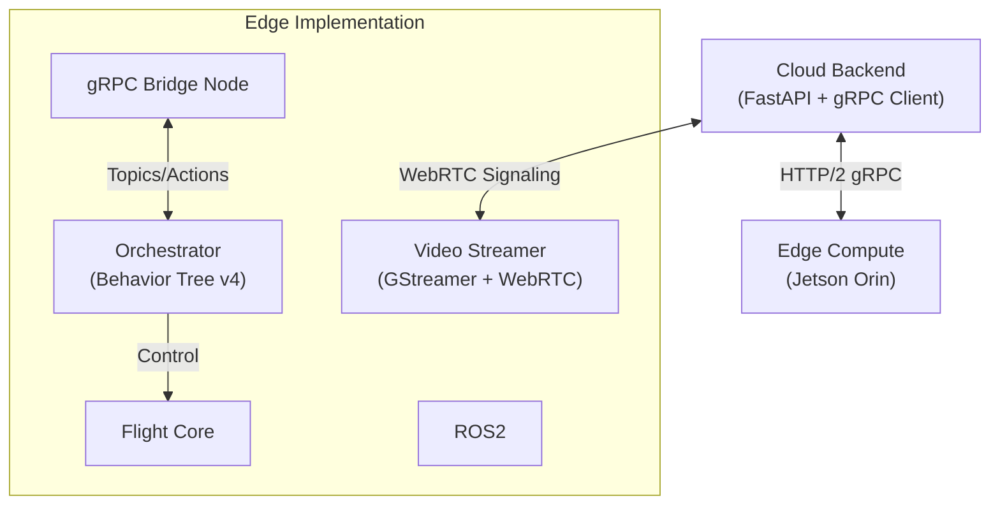

# UDS: 工业级城市无人机配送系统 (UAV Delivery System)


**UDS (UAV Delivery System)** 是一个旨在解决城市物流“末端 100 米”难题的**工业级无人机配送解决方案**。

本项目不仅仅是一个 ROS 2 Demo，它是对**云-边-端**协同架构的一次深度实践。系统采用**“慢决策、快执行”**的分层设计，利用最新的 **BehaviorTree.CPP v4** 构建高鲁棒性的决策大脑，能够在 GPS 拒止、通信断连等极端环境下保障飞行安全。

> *“在工业界，一个能稳定运行 1 万次不炸机的简单系统，价值远高于一个不可控的复杂演示。”*

---

## 🏗️ 核心架构与演进 (Architecture Evolution)

为了实现真正的工业级可靠性，项目架构正在经历从 V1.0 (原型) 到 V2.0 (生产级) 的演变。

### V1.0: 原型验证 (Current)
*   **通信**: 基于 `rosbridge` (WebSocket) 进行 JSON 消息转发。
*   **优劣**: 开发迅速，但 JSON 解析开销大，且 ROS 2 节点崩溃会影响视频流。

### V2.0: 工业级重构 (Architecture Roadmap)
为了彻底解耦业务逻辑与实时控制，我们正在推进以下架构升级：



1.  **通信层 (Communication)**: 迁移至 **gRPC (Protobuf)**。
    *   **目的**: 强类型接口定义，毫秒级指令下发，显著降低 CPU 占用。
    *   **实现**: `uav_grpc_bridge` 节点作为 ROS 2 与外部世界的唯一“外交官”。
2.  **视频层 (Video Streaming)**: 采用 **WebRTC (GStreamer)** 独立进程。
    *   **目的**: 绕过 ROS 2 消息序列化，直接利用硬件编码器，实现 <200ms 的“玻璃到玻璃”超低延迟。
    *   **优势**: 即使 ROS 2 核心崩溃，后台仍能看到实时画面并触发底层硬件复位。
3.  **控制层 (Backend)**: Python (FastAPI) 仅负责非实时的订单调度与状态监控，不介入实时飞行回路。

---

## 🧠 决策即核心 (Behavior Tree as the Brain)

这是本项目最核心的**重头戏**。我们没有使用简单的状态机，而是采用了 **Behavior Tree (BT) v4** 来构建无人机的“大脑”。

*   **响应式序列 (ReactiveSequence)**: 支持**动态抢占**。例如，用户在 Web 端点击“暂停”，行为树会立即中断当前的 `MoveTo` 动作，切换至 `Hover` 状态，无需等待当前动作完成。
*   **多层级熔断 (Multi-Level Failsafe)**:
    *   Level 1 (轻微): GPS 精度下降 -> 切换至 Lidar Odometry 导航。
    *   Level 2 (中等): 电池 < 20% -> 放弃任务，执行 `ReturnToHome`。
    *   Level 3 (严重): 视觉丢失 -> 原地执行 `EmergencyLand`。
*   **可视化调试**: 集成 **Groot2** (Port 1667)，在研发过程中可以实时看到决策逻辑的跳转。

---

## 🛠️ 当前状态 (Current Status)

| 模块 | 进度 | 说明 |
| :--- | :--- | :--- |
| **仿真环境** | ✅ Ready | Gazebo Garden + PX4 SITL 闭环验证。 |
| **飞行控制** | ✅ Ready | 基于 FSM 的底层封装，轨迹平滑。 |
| **行为树** | 🟡 **Active** | 基础逻辑已通。**正在攻坚复杂故障恢复与断点续飞逻辑。** |
| **Web 后端** | 🟡 Prototype | 订单 API 可用，正准备迁移至 gRPC。 |
| **感知定位** | 🟡 Optimizing | FAST-LIO 建图正常，ArUco 降落正在优化光照鲁棒性。 |

---

## ⚡ 快速开始 (Quick Start)

### 1. 环境准备
*   Ubuntu 22.04 + ROS 2 Humble
*   PX4 Autopilot Toolchain

### 2. 编译
```bash
# 1. 克隆代码
git clone <repo_url> uav_ds
cd uav_ds
./ros2_ws/setup_dependencies.sh

# 2. 编译 ROS 2 包
cd ros2_ws
colcon build --symlink-install --packages-select uav_bt_agent uav_navigation flight_core uav_perception uav_simulation uav_slam uav_bringup
source install/setup.zsh
```

### 3. 运行仿真
启动全套系统（Gazebo, ROS 2, BT Agent, Bridge）：
```bash
ros2 launch uav_bringup uav_system.launch.py
```

### 4. 可视化
*   **逻辑**: 运行 `Groot2` 连接 `localhost:1667`。
*   **视觉**: `rviz2 -d ros2_ws/src/uav_bringup/config/default.rviz`。

---

## 📅 未来路线图 (Roadmap)

我们正在迈向 **V2.0 架构**：

- [ ] **Phase 1: 行为树深度进化**
    - [ ] 实现 `BatteryFailsafe` (智能返航/就地降落决策)。
    - [ ] 实现 `LinkLoss` (通信断连保护)。
- [ ] **Phase 2: 架构升级 (gRPC + WebRTC)**
    - [ ] 定义 `.proto` 接口文件。
    - [ ] 开发 `uav_grpc_bridge` 节点。
    - [ ] 集成 GStreamer WebRTC 客户端。
- [ ] **Phase 3: 多机协同**
    - [ ] 基于 gRPC 的多机调度算法。
