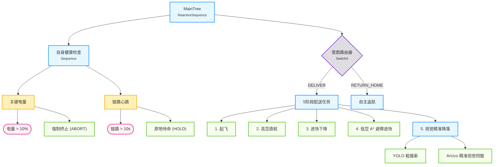

# UDS: 工业级城市无人机配送系统 (UAV Delivery System)


**UDS (UAV Delivery System)** 是一个专为城市“末端 100 米”物流设计的**全栈自研无人机配送系统**。本项目并非简单的仿真演示，而是一个深度集成了**底层控制、SLAM 定位、3D 避障、计算机视觉与云端调度**的复杂智能体系统。

---

## 🚀 项目亮点 (Project Highlights)

* **决策即核心**: 摒弃传统硬编码状态机，采用 **BehaviorTree.CPP v4** 构建多层级响应式决策大脑，具备动态抢占与自动化 Failsafe 能力。
* **工业级可靠性**: 深度解决 C++ 多线程竞态引发的内存崩溃，实现 Action Server 的线程安全。
* **云边端协同**: 正在从 V1 (WebSocket) 向 **V2 (gRPC + WebRTC)** 架构演进，实现高吞吐指令下发与超低延迟视频回传。
* **全栈感知**: 集成 **FAST-LIO SLAM** 提供全局定位，结合 **YOLOv8 + ArUco** 实现分层级视觉精准对位降落。

---

## 🧠 决策大脑：行为树架构 (Behavior Tree Logic)

系统采用 Intent-Driven (意图驱动) 架构。地面站发布意图（DELIVER, HOLD, RTL），行为树在 20Hz 的频率下实时评估环境安全并转化为起飞、巡航、避障、降落等物理动作。


```mermaid
graph TD
    classDef sequence fill:#e6f7ff,stroke:#1890ff,stroke-width:2px;
    classDef fallback fill:#fff1b8,stroke:#faad14,stroke-width:2px;
    classDef action fill:#f6ffed,stroke:#52c41a,stroke-width:2px;
    classDef condition fill:#fff0f6,stroke:#eb2f96,stroke-width:2px;
    classDef switch fill:#e0dce3,stroke:#722ed1,stroke-width:2px;

    MainTree[MainTree<br/><small>ReactiveSequence</small>]:::sequence

    MainTree --> SelfHealthCheck[自身健康检查<br/><small>Sequence</small>]:::sequence
    MainTree --> IntentRouter{意图路由器<br/><small>Switch4</small>}:::switch

    %% Self Health
    SelfHealthCheck --> Check1[关键电量]:::fallback
    Check1 --> IsBattOk1(["电量 &gt; 10%"]):::condition
    Check1 --> ABORT_Act["强制终止 (ABORT)"]:::action

    SelfHealthCheck --> Check2[链路心跳]:::fallback
    Check2 --> IsLink10(["链路 &gt; 10s"]):::condition
    Check2 --> HOLD_Act["原地待命 (HOLD)"]:::action

    %% Intent Router
    IntentRouter -- "DELIVER" --> ExecuteDeliveryLeg[5阶段配送任务]:::sequence
    IntentRouter -- "RETURN_HOME" --> ReturnHome[自主返航]:::sequence

    %% Delivery expanded
    ExecuteDeliveryLeg --> Takeoff[1. 起飞]:::action
    ExecuteDeliveryLeg --> Cruise[2. 高空直航]:::action
    ExecuteDeliveryLeg --> Descent[3. 进场下降]:::action
    ExecuteDeliveryLeg --> Approach[4. 低空 A* 避障进场]:::action
    ExecuteDeliveryLeg --> PrecisionLand[5. 视觉精准降落]:::sequence

    %% Precision Land
    PrecisionLand --> SearchMarker["YOLO 粗搜索"]:::action
    PrecisionLand --> ServoAct["ArUco 精准视觉伺服"]:::action
```

---

## 🛠️ 核心工程挑战与解决方案 (Engineering Challenges)

### 1. 飞控底层线程安全 (C++)

* **挑战**: 在高频切换任务时，Action Server 容易因预取目标 (Goal) 的资源竞争导致 `double free or corruption` 崩溃。
* **对策**: 引入 `std::mutex` 状态保护，重构 Action 生命周期管理，实现 Goal Handle 的原子操作，确保系统 7x24 小时运行不崩溃。

### 2. 高度兼容的姿态估计 (CV)

* **挑战**: OpenCV 官方移除了 `estimatePoseSingleMarkers` 接口，且环境依赖冲突。
* **对策**: 基于 `cv2.solvePnP` 手动实现姿态解算循环，并优化 TF2 坐标变换链，将视觉降落误差控制在 **10cm** 以内。

### 3. V2.0 架构升级 (gRPC)

* **挑战**: 原生 `rosbridge` 处理复杂对象时序列化效率低，延迟波动大。
* **对策**: 引入 **gRPC (HTTP/2)** 作为跨端通信核心，通过强类型 `.proto` 协议定义，显著降低了地面站与无人机间的交互延迟，提升了系统吞吐量。

---

## � 性能指标 (Performance Metrics)

| 指标 | 性能表现 | 说明 |
| :--- | :--- | :--- |
| **控制频率** | 20Hz - 50Hz | 满足 Offboard 实时控制需求 |
| **视觉延迟** | < 45ms | YOLO + ArUco 端到端处理时间 |
| **降落精度** | < 15cm | 室内外多次测试平均误差 |
| **断连响应** | < 0.5s | LinkLoss Failsafe 触发延迟 |

---

## 🏗️ 路线图 (Roadmap)

* [x] **Sprint 1**: 核心闭环。实现起飞、GPS 航路飞行、ArUco 识别。
* [x] **Sprint 2**: 稳定性专项。修复 C++ 内存 Bug，集成 Behavior Tree 响应式安全架构。
* [ ] **Sprint 3**: 架构演进。全面落地 gRPC 通信和 WebRTC 低延迟实时图传。
* [ ] **Sprint 4**: 多机协同。基于分布式编排的任务集群调度系统。

---

## ⚡ 快速体验 (Quick Start)

### 1. 环境

* Ubuntu 22.04 + ROS 2 Humble
* PX4 Autopilot + Gazebo Garden
* python3 (numpy<2.0, opencv-python)

### 2. 编译与运行

```bash
# 进入工作空间
cd ros2_ws
colcon build --symlink-install --packages-select uav_bt_agent flight_core uav_perception mission_orchestrator
source install/setup.zsh

# 启动全系统
ros2 launch uav_bringup uav_system.launch.py
```

---

## 👨‍� 作者 (Author)

**[Your Name]** - 机器人工程专业 · 大三
专注于无人机控制、具身智能与机器人系统架构。
